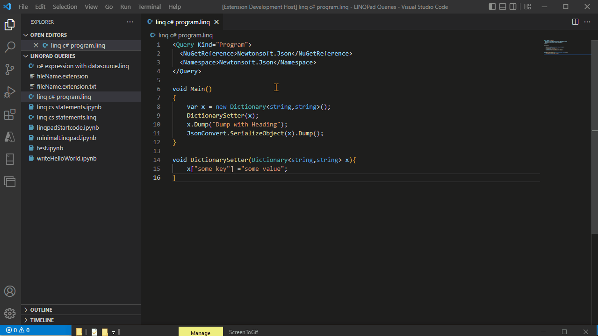

# Convert To .NET Notebook

Open a .linq file (LINQPad script) in VS Code, right click anywhere in the editor window and select the 'Convert to .NET Interactive Notebook'
- Context menu item for conversion only appears for .linq files.
- This extension runs entirely offline, code cells importing nuget packages may require internet connection

This project was created as part of a Microsoft Hackathon and is in a "proof of concept" stage.

## Video



## Requirements

- .NET Interactive Notebooks (VS Code extension)
- .NET 6 (required by conversion binaries)

## Extension Settings

None

## Known Issues

- You have to wait for VS Code to load the .NET Interactive engine before you click play on the first cell
- Restart VS Code if the Cells are not running properly

## Release Notes

### 1.0.0

Initial release


---

## For more information

* [Binaries for .linq to .ipynb conversion](https://github.com/ambrose-leung/linqpad-interactive)

**Enjoy!**

---
Example Linqpad format:
```
<Query Kind="Program">
  <NuGetReference>Newtonsoft.Json</NuGetReference>
  <Namespace>Newtonsoft.Json</Namespace>
</Query>

void Main()
{
	var x = new Dictionary<string,string>();
	DictionarySetter(x);
	x.Dump("Dump with Heading");
	JsonConvert.SerializeObject(x).Dump();
}

void DictionarySetter(Dictionary<string,string> x){
	x["some key"] ="some value";
}
```